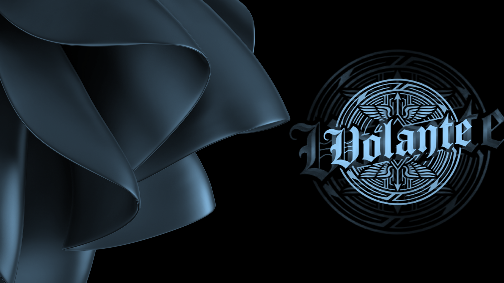

## Salutations, as you will

I do try to keep things professional, but sometimes it’s alright to wander off into distant worlds—ideas and illusions that may turn into reality someday. Turning those into reality is a constant effort, but okay, I guess -?  
Most of my work is centered around **cybersecurity** in general.  
That said, yes—I do wander out into distant worlds from time to time... :)

If you’re looking for something specific, you’ll likely find it in the **Repositories** section, so go ahead and start there.

---

I do follow up on stuff but in case I leave out or else if you  
### Want to talk?
- **LinkedIn:** https://www.linkedin.com/in/volantethakur or https://www.linkedin.com/in/adwaitbhardwaj  
- **YouTube:** https://www.youtube.com/@volantethakur  
- **Email:** volantethakur@gmail.com or cdtadwaitbhardwaj@outlook.in  

---

Anyway, this was **Adwait Bhardwaj**  
*(aka. vt-abt)*

---

This GitHub account has evolved over time. What began as one of my personal profiles has, through various events and transfers, become a consolidated home for several accounts that were once separate: `/volantethakur`, `/vnr517`, `/cspectreman`, `/clipper-spectreman`, `/nevermind0102`, `/vt-abt-alt`, `/vt-abt-alt-alt`, `/sceptre-ab`, and `/vnr517-b-side`.  

Many of those repositories carry pieces of work and memories from both myself and someone very dear who is no longer with us—Aishwarya Saha (vnr517). This space now quietly holds both our contributions together.

All projects here may stem from individual efforts or small teams. The profile itself is maintained with care on behalf of those shared journeys.

Any inconvenience caused by this consolidation is regretted.

---

I hope this little corner of the internet serves you well—whether you're exploring code, chasing ideas, or just passing through.
